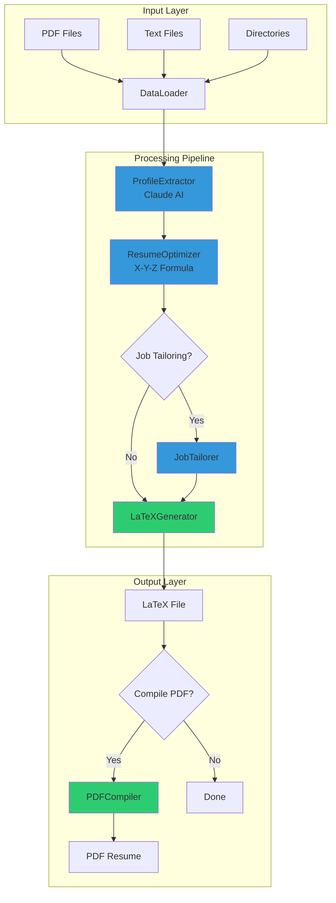
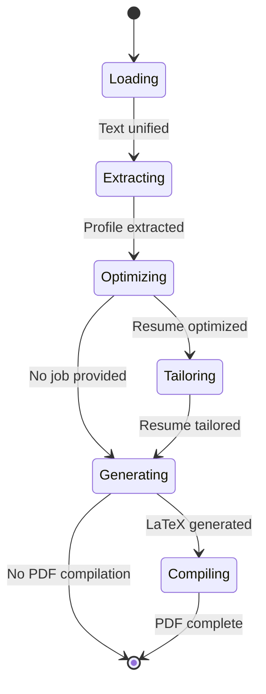
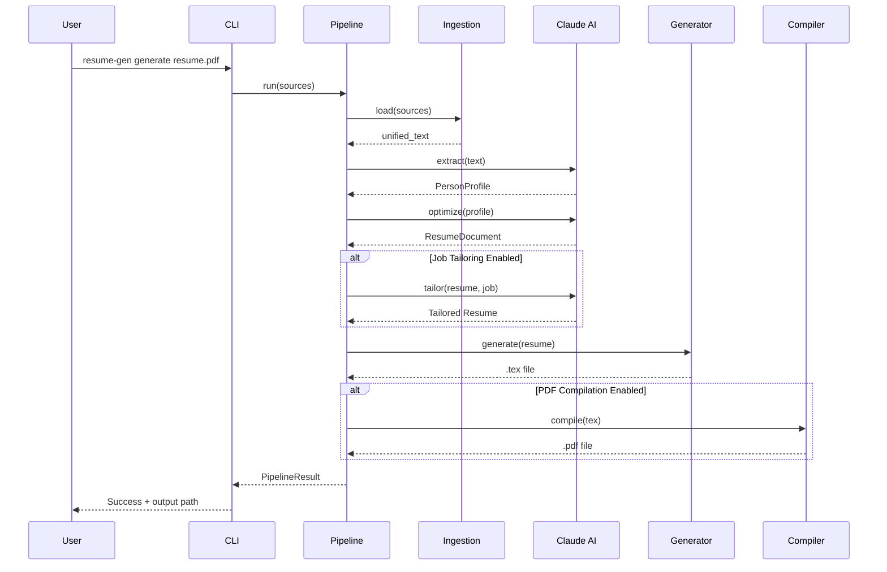

# Architecture

## Overview

The Resume Generator is a modular, pipeline-based system that transforms raw professional data into optimized, ATS-friendly resume PDFs using Claude AI. The architecture follows a clean separation of concerns with well-defined stages and data flow.

## System Architecture



## Core Components

### 1. Ingestion Layer (`src/resume_generator/ingestion/`)

Responsible for loading and extracting text from various input sources.

**Components:**
- `BaseExtractor`: Abstract interface for text extraction
- `PDFExtractor`: Extracts text from PDF files using PyPDF
- `TextExtractor`: Handles plain text and markdown files
- `DataLoader`: Orchestrates multi-source data loading

**Data Flow:**
```
Input Sources → Extractors → Unified Text → Pipeline
```

**Key Features:**
- Multi-format support (PDF, TXT, MD)
- Batch processing from directories
- Graceful error handling with skip-on-failure
- Text normalization and cleaning

### 2. Extraction Layer (`src/resume_generator/extraction/`)

Uses Claude AI to extract structured profile data from unstructured text.

**Components:**
- `ProfileExtractor`: Claude-powered profile extraction
- `extraction_prompts.py`: Prompt templates for AI extraction

**Input:** Raw text from ingestion
**Output:** `PersonProfile` model with structured data

**AI Process:**
1. Sends raw text to Claude with extraction prompt
2. Claude analyzes and structures the information
3. Validates response against Pydantic schema
4. Returns fully typed `PersonProfile` object

### 3. Optimization Layer (`src/resume_generator/optimization/`)

Enhances resume content using proven impact formulas and job-specific tailoring.

**Components:**
- `ResumeOptimizer`: Applies X-Y-Z formula to bullet points
- `JobTailorer`: Tailors resume to specific job descriptions
- `optimization_prompts.py`: Optimization prompt templates

**X-Y-Z Formula:**
```
"Accomplished [X] as measured by [Y], by doing [Z]"
```

**Tailoring Strategy:**
- Keyword matching and density optimization
- Content prioritization based on job requirements
- Maintains authenticity while maximizing relevance

### 4. Generation Layer (`src/resume_generator/generation/`)

Converts optimized resume data into professional LaTeX documents.

**Components:**
- `LaTeXGenerator`: Template-based document generation
- `PDFCompiler`: LaTeX to PDF compilation
- `templates/`: LaTeX template files

**Templates:**
- `modern`: Professional two-column design with color accents
- `ats`: Single-column, machine-readable format

**Process:**
```
ResumeDocument → Template Engine → LaTeX → pdflatex → PDF
```

### 5. Models Layer (`src/resume_generator/models/`)

Defines the data structures used throughout the pipeline.

**Key Models:**
- `PersonProfile`: Raw professional profile data
- `ResumeDocument`: Optimized resume content
- `JobDescription`: Job posting information
- `WorkExperience`: Job history entries
- `Education`: Education background
- `ContactInfo`: Contact details

All models use Pydantic for:
- Type safety and validation
- JSON serialization
- Schema generation
- Runtime validation

### 6. UI Layer (`src/resume_generator/ui/`)

Provides beautiful terminal interface with real-time progress tracking.

**Components:**
- `PipelineUI`: Rich-based progress display
- `PipelineStage`: Stage enumeration
- `PipelineStats`: Statistics tracking

**Features:**
- Real-time stage progress
- File loading counters
- Optimization metrics
- Keyword match rates
- Error display with context

### 7. Configuration (`src/resume_generator/config.py`)

Centralized configuration management using Pydantic Settings.

**Configuration Sources:**
1. Environment variables (with `RESUME_GEN_` prefix)
2. `.env` file
3. Default values

**Key Settings:**
- API configuration (key, model, timeout)
- Path configuration (output, cache)
- Template and design options
- Content optimization parameters
- Pipeline behavior flags

## Pipeline Orchestration

### Main Pipeline Class: `ResumePipeline`

The `ResumePipeline` class orchestrates the entire process with three execution modes:

#### 1. Synchronous Execution (`run()`)
```python
pipeline = ResumePipeline(settings=settings)
result = pipeline.run(sources=["resume.pdf"], output_path="output.pdf")
```

#### 2. Asynchronous Execution (`run_async()`)
```python
result = await pipeline.run_async(sources=["resume.pdf"])
```
- CPU-bound operations run in thread pool
- Non-blocking event loop
- Same pipeline flow as synchronous

#### 3. Callback-based Execution (`run_with_callbacks()`)
```python
result = pipeline.run_with_callbacks(
    sources=["resume.pdf"],
    on_stage_complete=lambda stage, result: print(f"{stage} done"),
)
```

### Pipeline Stages



**Stage Descriptions:**

| Stage | Component | Input | Output | Duration |
|-------|-----------|-------|--------|----------|
| **Loading** | DataLoader | File paths | Unified text | ~1-2s |
| **Extracting** | ProfileExtractor | Raw text | PersonProfile | ~5-10s |
| **Optimizing** | ResumeOptimizer | PersonProfile | ResumeDocument | ~8-15s |
| **Tailoring** | JobTailorer | ResumeDocument + Job | Tailored Resume | ~6-12s |
| **Generating** | LaTeXGenerator | ResumeDocument | .tex file | <1s |
| **Compiling** | PDFCompiler | .tex file | .pdf file | ~2-4s |

### Error Handling

**Exception Hierarchy:**
```
Exception
├── PipelineError (base pipeline exception)
    ├── ExtractionError (AI extraction failures)
    ├── OptimizationError (optimization failures)
    ├── TailoringError (tailoring failures)
    └── CompilationError (LaTeX/PDF failures)
```

**Error Recovery:**
- Stage-level error isolation
- Graceful degradation where possible
- Detailed error messages with context
- Failed stage tracking in results

## Data Flow

### Complete Pipeline Data Flow



### Model Transformations

```
Raw Text
    ↓ (ProfileExtractor)
PersonProfile {
    name, email, experiences[], education[], skills[]
}
    ↓ (ResumeOptimizer)
ResumeDocument {
    contact, summary, experiences[optimized], education[], skills[]
    + optimization_score
}
    ↓ (JobTailorer - optional)
ResumeDocument {
    [same structure, tailored content]
    + keyword_match_rate
}
    ↓ (LaTeXGenerator)
LaTeX Document (.tex)
    ↓ (PDFCompiler)
PDF Resume (.pdf)
```

## Design Patterns

### 1. Pipeline Pattern
Sequential processing stages with clear data transformations at each step.

### 2. Strategy Pattern
Interchangeable extractors for different file formats.

### 3. Template Method Pattern
LaTeX generation with customizable templates.

### 4. Builder Pattern
Configuration building with defaults and overrides.

### 5. Dependency Injection
Components receive dependencies through constructor injection.

## Technology Stack

### Core Dependencies
- **Python 3.11+**: Modern Python with type hints
- **Anthropic SDK**: Claude AI integration
- **Pydantic v2**: Data validation and settings
- **Rich**: Terminal UI
- **PyPDF**: PDF text extraction
- **Jinja2**: Template rendering
- **Typer**: CLI framework

### Development Tools
- **pytest**: Testing framework
- **pytest-asyncio**: Async test support
- **pytest-cov**: Coverage reporting
- **mypy**: Static type checking (strict mode)
- **pyright**: Additional type checking
- **ruff**: Fast linting and formatting

## Performance Considerations

### Optimization Strategies

1. **Async Execution**: CPU-bound AI operations run in thread pools
2. **Caching**: Resume cache to avoid re-processing
3. **Batch Processing**: Multiple files processed efficiently
4. **Lazy Loading**: Templates loaded on-demand
5. **Streaming**: Large file processing in chunks

### Bottlenecks

- **AI API Calls**: 5-15s per call (extraction, optimization, tailoring)
- **PDF Compilation**: 2-4s for pdflatex
- **PDF Extraction**: ~1s for large PDFs

### Scalability

The architecture supports:
- Parallel pipeline execution for multiple resumes
- Queue-based processing for batch jobs
- Distributed processing with shared settings
- Horizontal scaling via API-based deployment

## Security Considerations

### Data Privacy
- No data persistence unless explicitly cached
- API keys via environment variables only
- Local file processing (no external storage)
- Cache directory permissions enforced

### Input Validation
- File path sanitization
- File size limits
- Content validation via Pydantic
- LaTeX injection prevention in templates

### Process Security
- Subprocess timeout enforcement
- Output sanitization
- Error handling and logging

## Extension Points

### Adding New File Formats
1. Implement `BaseExtractor` interface
2. Register in `DataLoader`
3. Add format detection logic

### Custom Templates
1. Create `.tex` template in `templates/`
2. Add template enum value
3. Update template loader

### Additional AI Features
1. Add new prompt in `prompts.py`
2. Create processor class
3. Integrate in pipeline stage

### Custom Optimizers
1. Implement optimizer interface
2. Configure via settings
3. Chain with existing optimizers

## Testing Strategy

### Test Pyramid
```
         /\
        /UI\         (E2E tests)
       /────\
      /  API \       (Integration tests)
     /────────\
    /   Unit   \     (Unit tests)
   /────────────\
```

### Test Coverage
- Unit tests for all core logic
- Integration tests for pipeline stages
- E2E tests with real data
- Async test support
- Mock Claude API responses

## Deployment

### Local Development
```bash
pip install -e ".[dev]"
export RESUME_GEN_ANTHROPIC_API_KEY="sk-ant-..."
resume-gen generate resume.pdf
```

### Production Deployment
```bash
pip install resume-generator
# Configure via environment variables
# Run as CLI tool or import as library
```

### Docker Deployment
```dockerfile
FROM python:3.11
RUN apt-get update && apt-get install -y texlive-latex-base
COPY . /app
RUN pip install /app
CMD ["resume-gen"]
```

## Future Enhancements

1. **Web Interface**: Browser-based UI for resume generation
2. **Template Gallery**: More template options
3. **Multi-language Support**: Resumes in different languages
4. **Version Control**: Resume version management
5. **Analytics**: Success metrics and A/B testing
6. **Integrations**: LinkedIn import, ATS export formats

## References

- [Pydantic Documentation](https://docs.pydantic.dev/)
- [Anthropic Claude API](https://docs.anthropic.com/)
- [Rich Terminal UI](https://rich.readthedocs.io/)
- [LaTeX Documentation](https://www.latex-project.org/)
